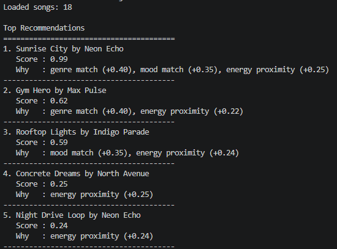
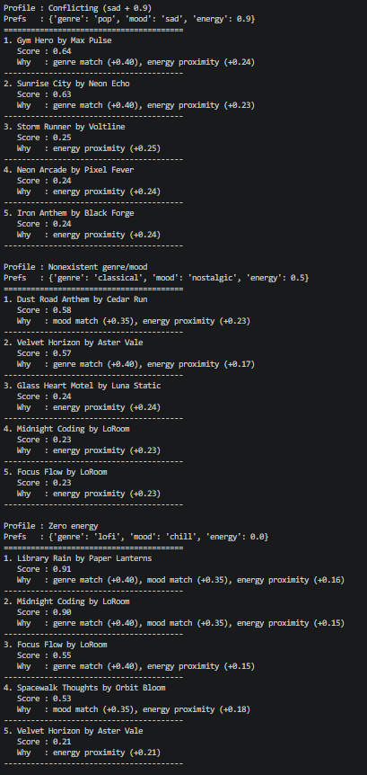
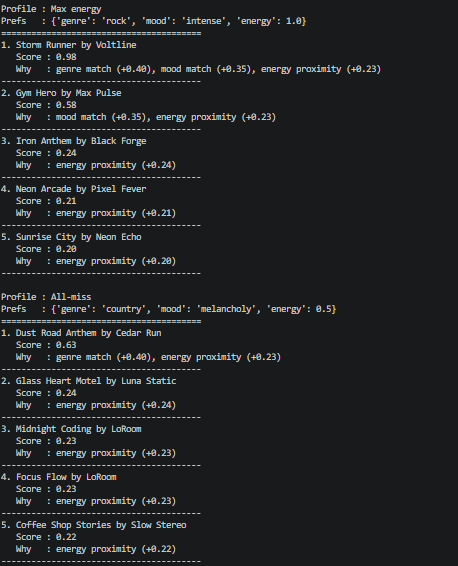

# 🎵 Music Recommender Simulation

## Project Summary

In this project you will build and explain a small music recommender system.

Your goal is to:

- Represent songs and a user "taste profile" as data
- Design a scoring rule that turns that data into recommendations
- Evaluate what your system gets right and wrong
- Reflect on how this mirrors real world AI recommenders

Replace this paragraph with your own summary of what your version does.

---

## How The System Works

Real-world recommendation systems like Spotify or YouTube usually combine many signals, such as clicks, likes, skips, watch or listen time, and patterns from similar users, to predict what someone will enjoy next. My version is much simpler and fully content-based: it compares every song to a single taste profile and prioritizes three features, `genre`, `mood`, and `energy`.

Each `Song` in my simulation stores `genre`, `mood`, and `energy`, and the `UserProfile` stores a target value for those same three features. My finalized taste profile is `genre = lofi`, `mood = chill`, and `energy = 0.40`. The recommender loops through every song in the CSV and computes three partial scores: a `genre_score` of `1` if the genre matches and `0` otherwise, a `mood_score` of `1` if the mood matches and `0` otherwise, and an `energy_score` of `1 - abs(song_energy - user_energy)` so songs are rewarded for being closer to the user's preferred energy rather than simply being higher or lower.

The final scoring rule is a weighted sum:

`final_score = 0.40 * genre_score + 0.35 * mood_score + 0.25 * energy_score`

After every song is scored, the system sorts all songs from highest to lowest score and returns the top recommendations. This design is transparent and easy to explain, but I expect some bias from the simplicity of the rules. For example, it may over-favor songs that share the exact labels in the profile instead of recommending more diverse options.



---

## Getting Started

### Setup

1. Create a virtual environment (optional but recommended):

   ```bash
   python -m venv .venv
   source .venv/bin/activate      # Mac or Linux
   .venv\Scripts\activate         # Windows

2. Install dependencies

```bash
pip install -r requirements.txt
```

3. Run the app:

```bash
python -m src.main
```

### Running Tests

Run the starter tests with:

```bash
pytest
```

You can add more tests in `tests/test_recommender.py`.

---

## Experiments You Tried

### Baseline Profiles (Pop Fan, Chill Indie, Workout Hip-Hop)


**Pop Fan vs Chill Indie:** The Pop Fan scored 0.99 on its top result because all three fields matched a song in the catalog. The Chill Indie profile peaked at 0.59 because "indie" matched nothing — only mood carried weight. The difference shows how much a single missing genre label can cut the ceiling score nearly in half.

**Chill Indie vs Workout Hip-Hop:** Both profiles have no genre match in the catalog, but their outputs look very different. Chill Indie still found three songs with a mood match ("chill" exists), giving scores around 0.57–0.59. Workout Hip-Hop found no genre or mood matches at all, so its entire top five was ranked purely by energy proximity with a max of 0.25. Same structural problem (missing genre), but the mood coverage in the catalog determined whether the results were usable or noise.

### Adversarial Profiles (Conflicting, Nonexistent, Zero Energy)



**Pop Fan vs Conflicting (sad + 0.9):** Both profiles share genre: pop, so the same songs appear at the top. The difference is that Pop Fan's mood: happy matched "Sunrise City," pushing it to 0.99, while Conflicting's mood: sad matched nothing — dropping the top score to 0.64 from genre alone. The system did not register any contradiction between sad mood and 0.9 energy; it simply scored them independently and recommended high-energy pop to someone who asked for sad music.

**Conflicting vs Nonexistent:** The Conflicting profile still had a genre anchor (pop) so its top results were recognizable. The Nonexistent profile (classical / nostalgic) had no genre or mood match anywhere, collapsing the entire ranking to energy proximity. Both profiles show the scorer ignoring intent, but Nonexistent makes it most visible: a score of 0.57 at the top came from a partial mood match on a different song — not the user's actual preference.

**Zero Energy vs Nonexistent:** Zero Energy still produced meaningful results because its genre (lofi) and mood (chill) both exist in the catalog — the low energy target only hurt the energy component slightly. Nonexistent had the opposite problem: genre and mood were completely absent, so energy was the only signal regardless of the target value. The contrast shows that energy boundary values are not the real risk; catalog coverage of genre and mood labels is.

### Edge Case Profiles (Max Energy, All-miss)



**Zero Energy vs Max Energy:** These two boundary profiles both behaved correctly. Zero Energy ranked quiet lofi songs first, Max Energy ranked loud rock songs first, and neither produced unexpected scores or crashes. The energy proximity formula `1 - abs(song_energy - user_energy)` is numerically stable at both ends of the 0–1 range.

**Max Energy vs All-miss:** Max Energy had genre (rock) and mood (intense) matches in the catalog, giving "Storm Runner" a score of 0.98. All-miss (country / melancholy) found a genre match for country but no mood match, capping its top score at 0.63. Songs 2–5 in the All-miss list scored between 0.22 and 0.24 — indistinguishable from random — yet the output format presented them identically to the high-confidence Max Energy results. The visual parity between a 0.98 recommendation and a 0.23 one is the clearest demonstration that the system needs a confidence floor.

---

## Limitations and Risks

Summarize some limitations of your recommender.

Examples:

- It only works on a tiny catalog
- It does not understand lyrics or language
- It might over favor one genre or mood

You will go deeper on this in your model card.

---

## Reflection

Read and complete `model_card.md`:

[**Model Card**](model_card.md)

Write 1 to 2 paragraphs here about what you learned:

- about how recommenders turn data into predictions
- about where bias or unfairness could show up in systems like this


---

## 7. `model_card_template.md`

Combines reflection and model card framing from the Module 3 guidance. :contentReference[oaicite:2]{index=2}  

```markdown
# 🎧 Model Card - Music Recommender Simulation

## 1. Model Name

Give your recommender a name, for example:

> VibeFinder 1.0

---

## 2. Intended Use

- What is this system trying to do
- Who is it for

Example:

> This model suggests 3 to 5 songs from a small catalog based on a user's preferred genre, mood, and energy level. It is for classroom exploration only, not for real users.

---

## 3. How It Works (Short Explanation)

Describe your scoring logic in plain language.

- What features of each song does it consider
- What information about the user does it use
- How does it turn those into a number

Try to avoid code in this section, treat it like an explanation to a non programmer.

---

## 4. Data

Describe your dataset.

- How many songs are in `data/songs.csv`
- Did you add or remove any songs
- What kinds of genres or moods are represented
- Whose taste does this data mostly reflect

---

## 5. Strengths

Where does your recommender work well

You can think about:
- Situations where the top results "felt right"
- Particular user profiles it served well
- Simplicity or transparency benefits

---

## 6. Limitations and Bias

Where does your recommender struggle

Some prompts:
- Does it ignore some genres or moods
- Does it treat all users as if they have the same taste shape
- Is it biased toward high energy or one genre by default
- How could this be unfair if used in a real product

---

## 7. Evaluation

How did you check your system

Examples:
- You tried multiple user profiles and wrote down whether the results matched your expectations
- You compared your simulation to what a real app like Spotify or YouTube tends to recommend
- You wrote tests for your scoring logic

You do not need a numeric metric, but if you used one, explain what it measures.

---

## 8. Future Work

If you had more time, how would you improve this recommender

Examples:

- Add support for multiple users and "group vibe" recommendations
- Balance diversity of songs instead of always picking the closest match
- Use more features, like tempo ranges or lyric themes

---

## 9. Personal Reflection

A few sentences about what you learned:

- What surprised you about how your system behaved
- How did building this change how you think about real music recommenders
- Where do you think human judgment still matters, even if the model seems "smart"

